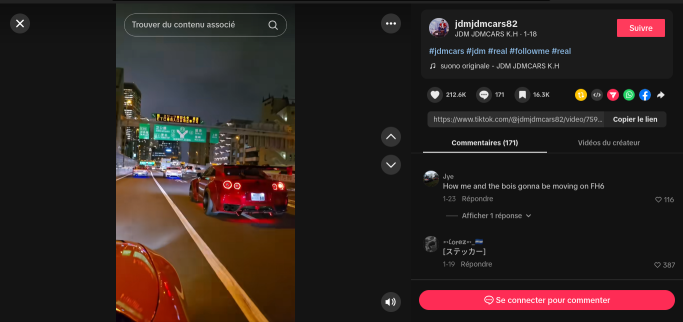
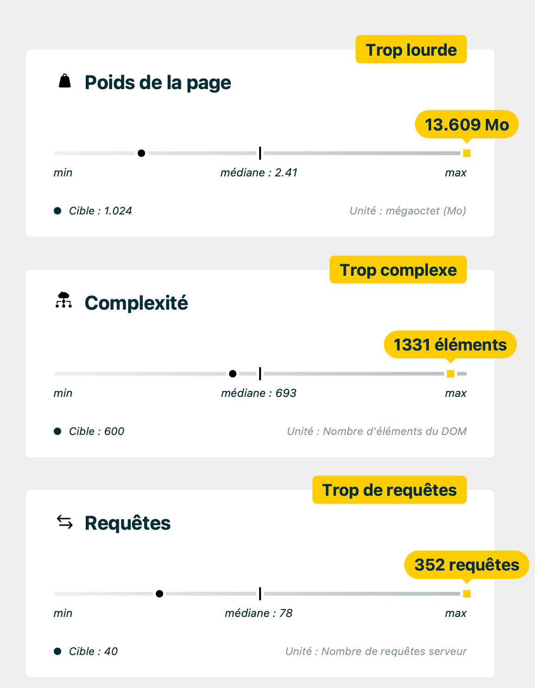
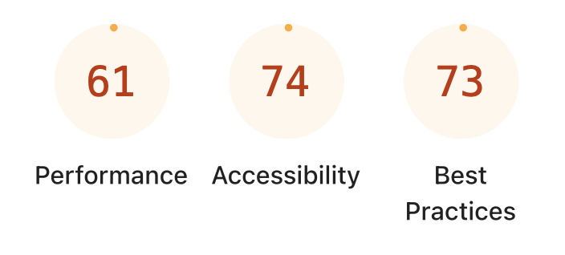

# TD 01 - Audit Éco-Conception : TikTok

Basile LE THIEC · Lilian NOACCO · Dorian POELLEN · Léon SCHER

Groupe 6

---

---

# Présentation du site analysé

**TikTok** — réseau social de courtes vidéos verticales, piloté par un algorithme de recommandation.

**Pages analysées :**
- **Page d'accueil** — `https://www.tiktok.com` — feed principal avec vidéos en autoplay
- **Page Explore** — `https://www.tiktok.com/explore` — grille de découverte de contenus tendance

---

**Outils utilisés :**
| Outil | Homepage | Explore |
|---|---|---|
| Google Lighthouse | Perf **61** · A11y **74** · BP **73** | Perf **36** · A11y **92** · BP **54** |
| EcoIndex | **33/100 → Grade E** · 5,03 Mo · 228 req · 509 DOM | **24.9/100 → Grade F** |
| Green Web Foundation | TikTok **n'utilise pas** d'énergie verte | — |
| GreenIT | Score **D** · EcoIndex **41.60** · 3.25cl eau · 2.17g CO₂ | Score **F** · EcoIndex **13.28** · 4.10cl eau · 2.73g CO₂ |
| Carbonalyzer | **117 MB** · **17g CO₂** · 2 recharges / min | **163 MB** · **20g CO₂** · 2 recharges / min |

---

# 5 points les plus problématiques

1. **Poids de page et nombre de requêtes excessifs** — Homepage : >10 Mo, 391 requêtes — Explore : 5 Mo, 185 requêtes
2. **JavaScript massif et non utilisé (obésiciel)** — 1,8 Mo de JS inutile (homepage) — TTI : 8,6 s (home), 21,6 s (explore)
3. **Algorithme de recommandation & autoplay infini (dark pattern)**
   Design conçu pour maximiser le temps d'écran, pas l'utilité
4. **Mauvaise sobriété environnementale confirmée par EcoIndex**
   Homepage : score **33/100 (grade E)** · 5,03 Mo · 228 requêtes · 509 éléments DOM
5. **Accessibilité et impacts sociaux insuffisants**
   A11y 74/100 ; cyberharcèlement, santé mentale, modération IA opaque

---

---

# Pourquoi ces points posent problème

| # | Problème | Impact éco-conception |
|---|---|---|
| 1 | 10 Mo / 391 req | Consommation réseau élevée, incompatible avec terminaux anciens → **obsolescence forcée** |
| 2 | 1,8 Mo JS inutilisé | **Obésiciel** : surcharge CPU 6,1 s, batterie, achat de matériel |
| 3 | Autoplay & scroll infini | **Effet rebond** : chaque optimisation UX augmente le temps passé → +data, +énergie |
| 4 | Mauvaise note EcoIndex | La homepage obtient **grade E** : le problème vient surtout du **poids de page** et du **nombre élevé de requêtes** |
| 5 | Accessibilité (74) | **Exclusion numérique** ; cyberharcèlement = impact social négatif |

---

# Améliorations proposées

| # | Action concrète | Acteur(s) |
|---|---|---|
| 1 | **Lazy-loading** des médias, compression, CDN, cache | Dev backend, DevOps |
| 2 | **Audits Lighthouse** en CI/CD, réduire les dépendances | Dev frontend, Tech Lead |
| 3 | **Limiter l'autoplay** par défaut, **"mode sobre"** avec pause auto, **supprimer le scroll infini** | Designer, Product Owner |
| 4 | **Réduire le poids de la page** et le **nombre de requêtes**, migrer vers un hébergement plus sobre/vert | DevOps, Dev frontend, Manager |
| 5 | **Audits**, alt-texts, modération humaine, transparence algo | Dev, Designer, Safety |

---

# Conclusion

**Ce que nous avons appris :**

- L'éco-conception dépasse la performance technique : elle couvre l'**accessibilité**, l'**éthique** et les **effets rebond**
- TikTok : service fluide en apparence, mais **note E sur EcoIndex** sur la homepage
- Les **dark patterns** sont un problème d'éco-conception à part entière
- Les outils (Lighthouse, EcoIndex) permettent de **quantifier** des problèmes qui semblent abstraits

**Comment nous l'avons vécu :**
Exercice révélateur — difficile de mesurer en temps réel (outils limités), mais les données Lighthouse/EcoIndex suffisent pour objectiver l'empreinte d'un géant numérique.
